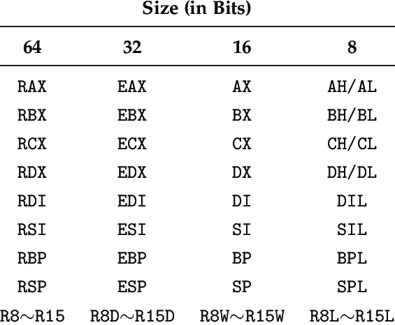

# Sky Seal

> The year is 2039. Humanity has grown heavily reliant on an ultra-secure satellite network known as SkyNet Quantum Link. But disaster strikes: a critical node, Satellite #10 – Sky Seal, suddenly goes dark.
A cybersecurity analyst team uncovers that an automatic lockdown has been triggered. To restore access, a valid authentication key must be regenerated.
Your objective is to analyze the binary file, understand the internal logic, and reconstruct the legitimate key that will restore access to the satellite’s data systems.
Time is critical. The longer Sky Seal 10 stays offline, the greater the risk of downstream system collapse.

This challenge was worth 372 points at the end of the CTF.

You can download the binary [here](bins/sky_seal_10), if you wanna follow along or try it yourself.

## Glossary

Here, I will just define assembly instructions/registers, those who are familiar with reverse engineering can skip this part.

### Registers
\
*Thanks researchgate.net*

### Instructions

- mov (Move): Store a value into a register
- movzx (Move with Zero Extend): Store a value into a register. Clearing the value of the bigger register. For example, when storing a value into `AL`, it will clear the register `RAX` as well.
- rol/ror (Rotate Left/Right): Rotate bits of a value n times.
- xor: Perform a XOR bitwise operation
- lea (Load Effective Address): Computes the address of the 2nd operand which will be stored in the first operand.
- cmp (Compare): Perform a comparison between two values.
- jnz (Jump if not Zero): In this case, this instruction will be the same as `jne` (Jump if Not Equal) which jumps to an address if two values are not equal, this instructions is paired with a `cmp`.

Finally, you may encouter this: `[expression]`. This will compute an address. When used with the `mov` instruction, the value will be dereferenced, the value at the address will be accessed. When used with `lea` the address computed is solely stored in the target register.

## The beginning

After loading the binary in IDA Pro, I noticed the challenge was written in rust. As we all know, rust can be tricky when it comes to reverse engineering.

### Strings

I always like to have a quick glance at the string, it may tell us some informations.

Hmmmmm, first, there seem to be a timer, and most importantly `Key must be 32 hex chars`.


### Decompilation
Now, let's look at the decompilation

```c
int __fastcall main(int argc, const char **argv, const char **envp)
{
  __int64 (__fastcall *_ZN11sky_seal_104main17haf0d6151cc25f244E_1)(); 
  // [rsp+0h] [rbp-8h] BYREF

  _ZN11sky_seal_104main17haf0d6151cc25f244E_1 = sky_seal_10::main;
  return std::rt::lang_start_internal(
           &_ZN11sky_seal_104main17haf0d6151cc25f244E_1,
           &anon_0f24caf8b84ffd292353431b2bbe8385_6_llvm_2370413822778485336,
           argc,
           argv,
           0);
}
```

We can deduce the main function is `sky_seal_10::main::haf0d6151cc25f244`.

After scrolling through the decompilation of that function, a few lines caught my eyes:


We can see that the first 8 lines are calculating what the second part of the key should be.
Furthermore the `LABEL_78` is called when you enter a wrong key.

Now that we know where the second part of the key is checked, the first part of the key shouldn't be that far away. We can go to `LABEL_78`, and sure enough the first part of the key is calculated right here!

Since `LABEL_78` isn't used anywhere else, we can guess there is only 2 parts of the key, each being 8 bytes. That means, the 32 hex char input are decoded from hex.


`v53` must be holding the key as it is dereferenced throughout this part.

## Calculating the key

### First part of the key

First, let's calculate the first part of the key as it seems to be the easiest.

From the decompilation above, we have:
```c
key[0] = "E4";
key[1] = "7F";
key[2] = "85";
key[3] = "A2";
key[4] = "D5";
key[5] = "AE";
key[6] = "74";
key[7] = "6F";
```

### Second part of the key

The decompilation looks ugly with all the dereferencing, let's have a look at the assembly.

```assembly
mov     r15, [rsp+7C8h+var_7C0]     ; Load the address of the second part of the key into r15
movzx   r9d, byte ptr [r15+1]       ; r9d = r15[1]
movzx   ebx, byte ptr [r15+3]       ; ebx = r15[3]
movzx   r11d, byte ptr [r15+5]      ; r11d = r15[5]
movzx   edx, byte ptr [r15+6]       ; edx = r15[6]
rol     dl, cl
xor     dl, sil
ror     dl, cl
rol     r11b, cl
movzx   edi, byte ptr [r15+4]       ; edi = r15[4]
lea     esi, [rax+0Fh]
xor     sil, r11b
ror     sil, cl
rol     dil, cl
xor     dil, r10b
ror     dil, cl
rol     bl, cl
movzx   r11d, byte ptr [r15+2]      ; r11d = r15[2]
lea     r10d, [rax+11h]
xor     r10b, bl
ror     r10b, cl
rol     r11b, cl
xor     r11b, r8b
ror     r11b, cl
rol     r9b, cl
movzx   ebx, byte ptr [r15]         ; ebx = r15[0]
lea     r8d, [rax+13h]
xor     r8b, r9b
ror     r8b, cl
rol     bl, cl
xor     bl, cl
ror     bl, cl
movzx   r9d, byte ptr [r15+7]       ; r9d = r15[7]
rol     r9b, cl
add     al, 0Dh
xor     al, r9b
ror     al, cl
cmp     bl, 0EAh
jnz     loc_50967
```

The algorithm looks very easy: `ciphered[i] = ror(rol(input[i], cl) ^ register, cl)`

We can reverse it to `deciphered[i] = rol(ror(ciphered[i], cl) ^ register, cl)`.
Here is the equivalent in python:
```py
def rol8(value, bits):
    bits &= 7
    return ((value << bits) | (value >> (8 - bits))) & 0xFF

def ror8(value, bits):
    bits &= 7
    return ((value >> bits) | (value << (8 - bits))) & 0xFF

def decipher(ciphered, xor_val):
    tmp = ror8(ciphered, 0x14)
    tmp ^= xor_val
    return rol8(tmp, 0x14)
```
`cl` is constantly used for the rotate right/left. Let's see what value is holds. 4 instructions above we have:
```assembly
lea     ecx, [rax+14h]
```
Again, scrolling a few instructions up, 
```assembly
movzx   eax, [rsp+7C8h+var_7A8]
```
Cross-referencing `var_7A8`, we find
```assembly
mov     [rsp+7C8h+var_7A8], 0
```

Due to how the `lea` instruction work, `ecx = [rax+0x14] = [0 + 0x14]= 20`. 
Great now we can start looking at the second part of the key!

Now, we have to know what value it is compared to, right below in the disassembly, there is:
```assembly
cmp     bl, 0EAh
jnz     loc_50967
cmp     r8b, 0C6h
jnz     loc_50967
cmp     r11b, 0D5h
jnz     loc_50967
cmp     r10b, 9Ah
jnz     loc_50967
cmp     dil, 8
jnz     loc_50967
cmp     sil, 3Fh
jnz     loc_50967
cmp     dl, 27h
jnz     loc_50967
cmp     al, 0EAh
jnz     loc_50967
```
We now have everything to build the key, let's go through it chronologically.

#### key[14]

```assembly
rol     dl, cl
xor     dl, sil
ror     dl, cl
```

We're missing the value inside `sil`, like always, scrolling up, we find:
```assembly
lea     esi, [rax+0Eh]
```
Since rax was set to 0, as we saw when calculating `cl`. We now know `sil = 0xE`. Destination register is `dl`, which is compared to `0x27`.

Applying the reversed algorithm, `decipher(0x27, 0xE) = 0xC7`

#### key[13]

The assembly for this is splattered, I'll rebuild it:
```assembly
rol     r11b, cl
lea     esi, [rax+0Fh]
xor     sil, r11b
ror     sil, cl
```
It is compared to `0x3F`, since `rax=0x0`, `decipher(0x3F, 0xF) = 0xCF`
ERROR
#### key[12]

```assembly
lea     r10d, [rax+10h]
...
movzx   edi, byte ptr [r15+4]
rol     dil, cl
xor     dil, r10b
ror     dil, cl
```

Compared to `0x8`, `decipher(0x8, 0x10) = 0x09`

#### key[11]

```assembly
rol     bl, cl
lea     r10d, [rax+11h]
xor     r10b, bl
ror     r10b, cl
```

Compared to `0x9A`, `r10d = 0x11`. `decipher(0x9A, 0x11) = 0x8B`

#### key[10]

```assembly
lea     r8d, [rax+12h]
...
rol     r11b, cl
xor     r11b, r8b
ror     r11b, cl
```

Compared to `0xD5`, `r8d = 0x12`, `decipher(0xD5, 0x12) = 0xF4`

#### key[9]

```assembly
lea     r8d, [rax+13h]
...
rol     r9b, cl
xor     r8b, r9b
ror     r8b, cl
```

Compared to `0xC6`, `r8d = 0x13`, `decipher(0xC6, 0x13) = 0xF7`

#### key[8]

```assembly
rol     bl, cl
xor     bl, cl
ror     bl, cl
```

Compared to `0xEA`, `decipher(0xEA, 0x14) = 0xAB`

#### key[15]

```assembly
rol     r9b, cl
add     al, 0Dh
xor     al, r9b
ror     al, cl
```

Compared to `0xEA`, `decipher(0xEA, 0xD) = 0x3A`

## Building it together
Finally, we have `key = "E47F85A2D5AE746FABF7F48B09CFC73A"`.

Running the binary we get:

```
Welcome to the sky_seal_10 challenge!

Key: E47F85A2D5AE746FABF7F48B09CFC73A

Good key, congratulations!
You can validate the challenge using the following flag: ECW{UNL0CK3D_BY_REV3RS3_ENG1N3!}
```